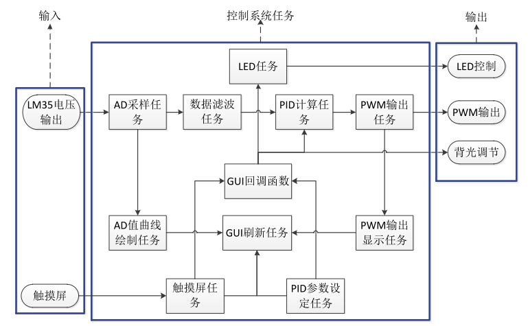
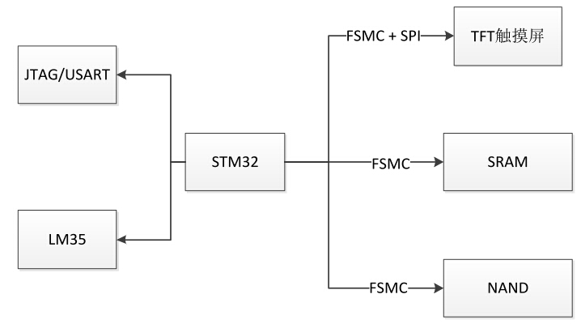
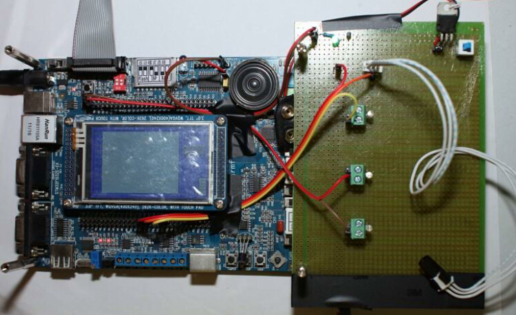
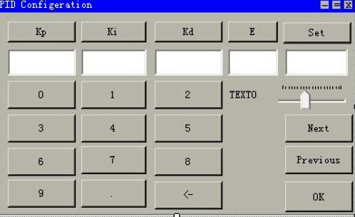
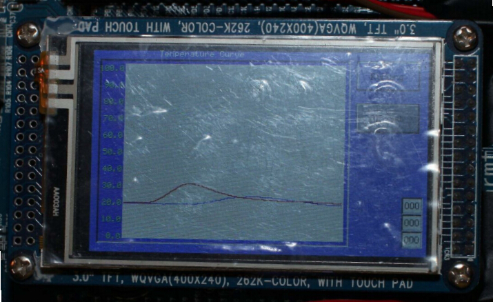

# MIO PID Control Based on STM32
## 功能
简而言之，就是一个2入3出的控制器。
## 使用方法
##### (1) PID 参数设定步骤 
系统复位后，首先进入的是曲线显示界面，点击 PID_Set 按键即进入 PID 窗口
主面板，然后再点击此页面的 PID_Set 按键弹出参数设定对话框，此时光标的焦点自动
设定到第一组的 Kp 参数编辑框中，系统对 Kp 值的范围设定为 0~999.999，默认 Kp值被设定为 1.0，此时要改变 Kp的值只需要点击虚拟数字键盘对应数字即可。

同样的完成 Ki、Kd、Set、加权 E，因为系统是两输入三输出，因此可以将 6 组设定值分为 3 组，其中Set 和权重 E值只需要设定两组，每完成一组设定可以点击 Next 和 Previous 来设定下一组参数，完成所有六组参数设定后点击OK，系统将自动调回到曲线显示窗口，开始运行。 

随后系统将采用默认周期 500 毫秒开始工作，并系统在程序上有上下限限制。 
最后可以进行输出参数设定，设定输出更新周期，输出方式以及 PWM 拟合匹配等。此步骤亦可以省略，默认输出更新周期 1秒，开关量输出，开启缓冲池。并将缓冲池的数据用曲线形式在 TFT的界面上显示出来。 
#####(2) 启动/停止设定 
在实时曲线窗口中有一个系统的运行和关闭按键，直接点击运行/停止按钮即可完成系统的运行与停止切换。操作结束后会按键上面的文字会显示此刻系统的状态。 
## 软硬件结构
##### μC/OS-II的Task
使用了RTOS：μC/OS-II，各个task分配如下：

##### 硬件结构
硬件的几大块如下图，其中lm335作为Analog输入传感器，输出为PWM。

硬件是买的STM32板子，然后直接外扩了需要的器件：

## GUI
因为用到了曲线显示，因此Porting了μC/GUI 3.98。而GUI方面，有主要由两个界面组成：
- PID与E的设定界面
- 实时曲线的显示界面

第一个界面用于设定

第二个用于实时显示

